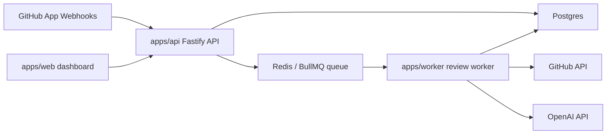

# DiffGuard-AI Production Deployment

This guide deploys DiffGuard-AI as a self-hosted Docker Compose stack with the
API, worker, web dashboard, Postgres, and Redis. It is written for a single
production host or VM. For managed container platforms, keep the same service
boundaries and environment variables.

## 1. Architecture Overview

DiffGuard-AI receives GitHub pull request webhooks, queues review jobs, runs the
AI review pipeline, posts high-confidence findings back to GitHub, and stores
review metadata for the dashboard.



Network shape:

- Public internet: reverse proxy, web dashboard, GitHub webhook URL.
- Private network: API, worker health port, Postgres, Redis.
- Outbound internet: worker to GitHub and OpenAI APIs.

## 2. Required Services

- API: `apps/api`, Fastify service for GitHub webhooks, dashboard API routes,
  health checks, metrics, rate limiting, CORS, and security headers.
- Worker: `apps/worker`, BullMQ worker that consumes review jobs, creates
  GitHub App installation tokens, calls OpenAI, and persists/post findings.
- Web dashboard: `apps/web`, Next.js dashboard that reads production review
  and eval data from the API.
- Postgres: durable storage for repositories, pull requests, review runs,
  findings, model calls, webhook deliveries, eval summaries, and resolution
  metrics.
- Redis: BullMQ queue backend for review jobs.

## 3. Required Environment Variables

Create `.env.production` outside source control. Do not commit it.

Minimum production file:

```bash
NODE_ENV=production
POSTGRES_DB=diffguard
POSTGRES_USER=diffguard
POSTGRES_PASSWORD=replace-with-a-long-random-password

GITHUB_APP_ID=123456
GITHUB_APP_PRIVATE_KEY=replace-newlines-with-\n-or-load-from-your-secret-manager
GITHUB_WEBHOOK_SECRET=replace-with-a-long-random-webhook-secret

OPENAI_API_KEY=replace-with-your-openai-api-key
OPENAI_RESOLUTION_MODEL=gpt-5.5

DIFFGUARD_DASHBOARD_API_KEY=replace-with-a-different-long-random-dashboard-key
DIFFGUARD_ALLOWED_ORIGINS=https://diffguard.example.com
DIFFGUARD_API_PORT=3001
DIFFGUARD_WEB_PORT=3000
```

Common optional settings:

```bash
REVIEW_QUEUE_NAME=diffguard-review-runs
DIFFGUARD_REVIEW_PASSES=logic-bugs,security-bugs,regression-test-gaps
DIFFGUARD_STATIC_CHECKS=true
DIFFGUARD_BODY_LIMIT_BYTES=1048576
DIFFGUARD_RATE_LIMIT_MAX_REQUESTS=120
DIFFGUARD_RATE_LIMIT_WINDOW_MS=60000
DIFFGUARD_DEMO_MODE=false
WORKER_HEALTH_PORT=3002
```

Production fail-fast behavior:

- API requires `DATABASE_URL`, `OPENAI_API_KEY`,
  `DIFFGUARD_ALLOWED_ORIGINS`, and `GITHUB_WEBHOOK_SECRET`.
- API requires `DIFFGUARD_DASHBOARD_API_KEY` unless
  `DIFFGUARD_DEMO_MODE=true`. Do not use demo mode in production.
- Worker requires `GITHUB_APP_ID`, `GITHUB_APP_PRIVATE_KEY`, and
  `OPENAI_API_KEY`.
- `docker-compose.prod.yml` derives `DATABASE_URL` from the Postgres settings.

## 4. GitHub App Setup

1. Create a GitHub App in GitHub organization or user settings.
2. Set the webhook URL to:

   ```text
   https://diffguard.example.com/webhooks/github
   ```

   If the API is on a separate host, use that API public URL instead.

3. Set the webhook secret to the same value as `GITHUB_WEBHOOK_SECRET`.
4. Subscribe to these events:
   - Pull request
   - Issue comment
5. Grant permissions:
   - Pull requests: read and write
   - Contents: read
   - Metadata: read
   - Issues: read and write, needed for issue comment commands and PR comment
     surfaces
6. Generate a private key. Store it in your secret manager or in
   `.env.production` with newlines escaped as `\n`.
7. Install the app on the repositories you want DiffGuard-AI to review.
8. Keep the App ID, private key, and webhook secret private. Never paste them
   into logs or screenshots.

## 5. OpenAI Setup

1. Create an OpenAI API key for the deployment.
2. Store it as `OPENAI_API_KEY` in `.env.production` or your secret manager.
3. Pick the review/validator model with `OPENAI_RESOLUTION_MODEL`.
4. Confirm outbound HTTPS from the worker to OpenAI is allowed.
5. Start with conservative review passes:

   ```bash
   DIFFGUARD_REVIEW_PASSES=logic-bugs,security-bugs,regression-test-gaps
   ```

OpenAI keys are redacted by the structured logger, but the deployment should
still treat them as secrets and rotate them if exposed.

## 6. Database Migration Steps

Start only Postgres and Redis:

```bash
docker compose -f docker-compose.prod.yml --env-file .env.production up -d postgres redis
```

Run production migrations:

```bash
docker compose -f docker-compose.prod.yml --env-file .env.production run --rm api pnpm --filter @diffguard/database exec prisma migrate deploy
```

Generate Prisma client if you are debugging inside a container:

```bash
docker compose -f docker-compose.prod.yml --env-file .env.production run --rm api pnpm --filter @diffguard/database exec prisma generate
```

Use `prisma migrate deploy` in production. Do not run `prisma migrate dev`
against production databases.

## 7. Docker Compose Production Deployment

Build images:

```bash
docker compose -f docker-compose.prod.yml --env-file .env.production build
```

Start the stack:

```bash
docker compose -f docker-compose.prod.yml --env-file .env.production up -d --build
```

Check service status:

```bash
docker compose -f docker-compose.prod.yml --env-file .env.production ps
```

Tail logs:

```bash
docker compose -f docker-compose.prod.yml --env-file .env.production logs -f api worker web
```

Default published ports:

- API: `http://localhost:3001`
- Web dashboard: `http://localhost:3000`

Do not expose Postgres or Redis directly to the public internet.

## 8. Reverse Proxy / HTTPS Notes

Put Nginx, Caddy, Traefik, or a managed load balancer in front of the web and
API services.

Recommended routing:

- `https://diffguard.example.com/` -> web dashboard on port `3000`
- `https://diffguard.example.com/webhooks/github` -> API on port `3001`
- `https://diffguard.example.com/dashboard/*` can stay on the web service; the
  web server calls the API server-side using `DIFFGUARD_API_BASE_URL`.

Reverse proxy requirements:

- Terminate TLS with a valid certificate.
- Forward `Host`, `X-Forwarded-For`, and `X-Forwarded-Proto`.
- Preserve webhook request bodies exactly. Do not transform JSON bodies before
  they reach `/webhooks/github`; signature verification depends on the raw body.
- Set proxy body size at or above `DIFFGUARD_BODY_LIMIT_BYTES`.
- Restrict direct access to API health and metrics endpoints if they are not
  needed publicly.

Example Nginx snippets:

```nginx
location /webhooks/github {
  proxy_pass http://127.0.0.1:3001;
  proxy_set_header Host $host;
  proxy_set_header X-Forwarded-For $proxy_add_x_forwarded_for;
  proxy_set_header X-Forwarded-Proto https;
  client_max_body_size 1m;
}

location / {
  proxy_pass http://127.0.0.1:3000;
  proxy_set_header Host $host;
  proxy_set_header X-Forwarded-For $proxy_add_x_forwarded_for;
  proxy_set_header X-Forwarded-Proto https;
}
```

Set `DIFFGUARD_ALLOWED_ORIGINS` to the dashboard HTTPS origin exactly, for
example `https://diffguard.example.com`. Wildcards are rejected in production.

## 9. Healthcheck Verification

Docker health:

```bash
docker compose -f docker-compose.prod.yml --env-file .env.production ps
```

API checks:

```bash
curl -fsS http://localhost:3001/health
curl -fsS http://localhost:3001/health/database
curl -fsS http://localhost:3001/health/redis
curl -fsS http://localhost:3001/health/ready
```

Worker checks run inside the container because the worker health port is not
published by default:

```bash
docker compose -f docker-compose.prod.yml --env-file .env.production exec worker node -e "fetch('http://127.0.0.1:3002/ready').then(async r => { console.log(r.status, await r.text()); process.exit(r.ok ? 0 : 1); }).catch((error) => { console.error(error); process.exit(1); })"
```

Web check:

```bash
curl -fsS http://localhost:3000/
```

Metrics:

```bash
curl -fsS http://localhost:3001/metrics
docker compose -f docker-compose.prod.yml --env-file .env.production exec worker node -e "fetch('http://127.0.0.1:3002/metrics').then(async r => console.log(await r.text()))"
```

Keep metrics endpoints behind private network or trusted ingress controls.

## 10. First Real PR Test

1. Install the GitHub App on a test repository.
2. Confirm the repository has a small pull request open.
3. Add a harmless test change that should trigger a review, for example a
   missing regression test or a clear logic bug in a test fixture branch.
4. Push the branch and open or synchronize the PR.
5. In GitHub App settings, confirm webhook delivery returns HTTP `202`.
6. Watch API logs:

   ```bash
   docker compose -f docker-compose.prod.yml --env-file .env.production logs -f api
   ```

   Look for `api.webhook.github` with `status:"queued"`.

7. Watch worker logs:

   ```bash
   docker compose -f docker-compose.prod.yml --env-file .env.production logs -f worker
   ```

   Look for `worker.review_job.completed`.

8. Check the PR for posted review comments. DiffGuard-AI should prefer no
   comment over low-confidence or speculative findings.
9. Open the dashboard and confirm the review run appears.

## 11. Common Errors and Fixes

`Missing required production environment variables`

- Cause: `NODE_ENV=production` and a required secret or URL is absent.
- Fix: add the named variables to `.env.production`, then recreate the service:

  ```bash
  docker compose -f docker-compose.prod.yml --env-file .env.production up -d --force-recreate api worker
  ```

`Invalid GitHub webhook signature`

- Cause: GitHub webhook secret does not match `GITHUB_WEBHOOK_SECRET`, or the
  reverse proxy modified the body.
- Fix: copy the exact secret into GitHub App settings and `.env.production`;
  disable proxy body rewriting for `/webhooks/github`.

`Origin is not allowed`

- Cause: dashboard origin is not in `DIFFGUARD_ALLOWED_ORIGINS`.
- Fix: set `DIFFGUARD_ALLOWED_ORIGINS=https://your-dashboard-host` and restart
  the API.

`Invalid dashboard API credentials`

- Cause: web and API services use different `DIFFGUARD_DASHBOARD_API_KEY`
  values.
- Fix: set the same key for both services through `.env.production` and restart
  `api` and `web`.

`Review job failed: GitHub App credentials are required`

- Cause: worker is missing `GITHUB_APP_ID` or `GITHUB_APP_PRIVATE_KEY`.
- Fix: set both values and restart the worker.

`OPENAI_API_KEY is not configured`

- Cause: OpenAI key missing. In production the worker fails fast; in local/CLI
  mode DiffGuard-AI skips LLM review safely.
- Fix: set `OPENAI_API_KEY` and restart worker/API as needed.

`P1001` or database connection failures

- Cause: API or worker cannot reach Postgres.
- Fix: check `docker compose ps postgres`, `DATABASE_URL`, Postgres password,
  and whether migrations were run.

Redis connection failures

- Cause: API or worker cannot reach Redis.
- Fix: check `docker compose ps redis`, `REDIS_URL`, and Redis container logs.

No PR comments posted

- Cause: no high-confidence finding, validator rejected candidates, missing
  OpenAI key in non-production mode, or GitHub App lacks write permission.
- Fix: inspect worker logs for validator rejection rate and GitHub API errors;
  confirm App permissions and installation.

## 12. Rollback Process

1. Identify the last known good image or Git revision.
2. Stop new review processing:

   ```bash
   docker compose -f docker-compose.prod.yml --env-file .env.production stop worker
   ```

3. Restore the previous code or image tag.
4. Rebuild the affected images:

   ```bash
   docker compose -f docker-compose.prod.yml --env-file .env.production build api worker web
   ```

5. Start services:

   ```bash
   docker compose -f docker-compose.prod.yml --env-file .env.production up -d api worker web
   ```

6. Verify health:

   ```bash
   docker compose -f docker-compose.prod.yml --env-file .env.production ps
   curl -fsS http://localhost:3001/health/ready
   ```

Database rollback guidance:

- Prefer forward fixes for schema changes.
- If a migration must be reverted, take a fresh backup first, restore to a
  staging database, validate the rollback plan, then apply it during a
  maintenance window.
- Do not manually edit Prisma migration history in production.

## 13. Backup Strategy for Postgres

Take logical backups before every deploy and on a schedule.

Manual backup:

```bash
mkdir -p backups
docker compose -f docker-compose.prod.yml --env-file .env.production exec -T postgres pg_dump -U "${POSTGRES_USER:-diffguard}" -d "${POSTGRES_DB:-diffguard}" --format=custom > backups/diffguard-$(date +%Y%m%d-%H%M%S).dump
```

Restore into a clean database:

```bash
docker compose -f docker-compose.prod.yml --env-file .env.production exec -T postgres pg_restore -U "${POSTGRES_USER:-diffguard}" -d "${POSTGRES_DB:-diffguard}" --clean --if-exists < backups/diffguard-YYYYMMDD-HHMMSS.dump
```

Recommended policy:

- Daily automated backups for active deployments.
- Extra backup before every migration.
- Store backups off-host.
- Encrypt backup storage.
- Test restore at least monthly.
- Keep enough retention to recover from delayed discovery of bad reviews,
  accidental deletes, or failed migrations.

Redis contains queue state, not durable review history. Postgres is the primary
system of record.

## 14. Security Checklist

Before production traffic:

- `NODE_ENV=production` is set for API and worker.
- `DIFFGUARD_DEMO_MODE=false`.
- `DIFFGUARD_ALLOWED_ORIGINS` contains only trusted HTTPS origins.
- GitHub webhook secret is long, random, and matches GitHub App settings.
- Dashboard API key is long, random, and shared only by API/web server-side
  environments.
- GitHub App private key is stored in a secret manager or protected env file.
- OpenAI API key is stored as a secret and not committed.
- `.env.production` is outside source control.
- Postgres and Redis are not publicly exposed.
- HTTPS is enabled at the reverse proxy.
- Proxy preserves raw webhook bodies.
- Body size limit is set with `DIFFGUARD_BODY_LIMIT_BYTES`.
- Rate limits are configured for public endpoints.
- Health and metrics endpoints are private or access controlled.
- Backups are automated and restore-tested.
- Logs are collected securely and checked for redaction.
- GitHub App permissions are the minimum needed for review operation.
- First PR test succeeded before enabling broader repository installations.
